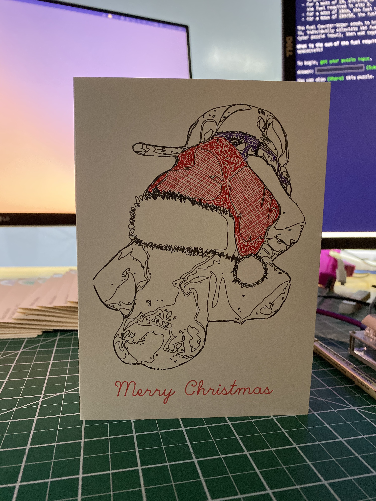

# 🎄 Holiday Axidraw Cards 🎅

In 2019, I sent ~60 holiday cards to friends in ON, AB, QC, RI, NY, WI, GA, CT, CA. I plan to do this every year for as long as my Axidraw works. This repo will serve as an archive for the designs from each year.

In `2019/tree-stipple.svg`, you will find an SVG generated by Inkscape with layers comprising my three designs with three accompanying holiday slogans used this year. The vector graphics were then plotted on card stock using an Axidraw v3 using the Axidraw Inkscape extension. You can download Inkscape [here](https://inkscape.org/).

If you'd like to receive a card, just email holidaycards@bellisar.io with a physical address anywhere in the world and I would love to send you one.
